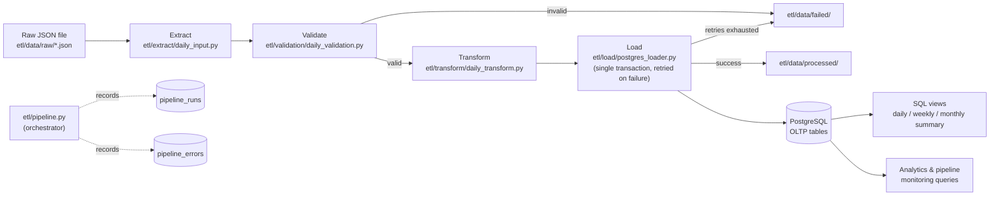
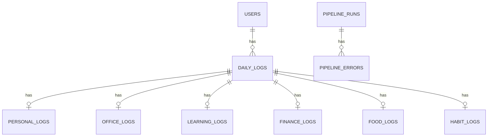

# MyDataHub

A personal data platform that applies production-style Data Engineering practices — extraction, validation, transformation, transactional loading, and pipeline observability — to everyday personal data (mood, work, learning, finance, food, and habits).

MyDataHub is not a demo script. It is a small but real batch ETL system with a normalized PostgreSQL schema, stage-aware error handling, retry logic, an audit trail for every pipeline run, and a test suite (unit + integration) that exercises the actual database.

## Mission

MyDataHub was built to apply real-world Data Engineering principles to everyday life: collect personal data as JSON, validate and transform it, load it into a relational database through production-style ETL patterns, and query it for long-term analytics. It doubles as a daily-use tool and as a hands-on playground for Data Engineering fundamentals — transactions, retries, auditability, and schema design.

## Current Architecture

What is implemented today, end to end:

```
JSON files (etl/data/raw/) → Python ETL pipeline → PostgreSQL (OLTP schema) → SQL views & analytics queries
```

There is **no web backend, frontend, or AI layer implemented yet** — see [Current Implementation Status](#current-implementation-status) for what exists on disk versus what is only scaffolding.



## Project Structure

```
MyDataHub/
├── etl/
│   ├── config/            # settings.py (paths, retry config), logging_config.py
│   ├── data/
│   │   ├── raw/           # Pipeline input — JSON files land here
│   │   ├── processed/     # Files that completed the pipeline successfully
│   │   └── failed/        # Files that failed extraction, validation, transform, or load
│   ├── extract/           # JSON file extraction
│   ├── transform/         # Structural normalization before loading
│   ├── validation/        # Business-rule validation
│   ├── load/               # PostgreSQL loading, transactions, pipeline run/error tracking
│   ├── utils/               # Retry (exponential backoff), file movement
│   └── pipeline.py          # Orchestrates extract → validate → transform → load per file
├── sql/
│   ├── schema/             # Table definitions, numbered 001–010
│   ├── indexes/            # Index definitions
│   ├── views/               # daily_summary, weekly_summary, monthly_summary
│   ├── queries/             # Analytics queries + pipeline monitoring queries
│   └── seeds/                # Sample data (currently an empty placeholder file)
├── tests/
│   ├── integration/          # Tests that hit a real Postgres test database
│   └── test_*.py              # Unit tests (mocked cursor/connection)
├── requirements.txt
├── .env / .env.test            # Local DB credentials (git-ignored)
└── README.md
```

Only `etl/`, `sql/`, `tests/`, and the root config files are tracked in git and contain code. See [Current Implementation Status](#current-implementation-status) for a note on other directories present in the working tree.

## Data Flow

1. A JSON file describing one day (`log_date` + optional `personal`, `office`, `learning`, `finance`, `food`, `habits` sections) is dropped into `etl/data/raw/`.
2. `etl/pipeline.py` picks up every `*.json` file in that folder (sorted by filename) and runs each one through **extract → validate → transform → load**.
3. On success, the file is moved to `etl/data/processed/`. On failure at any stage, it is moved to `etl/data/failed/` and the failure is recorded in `pipeline_errors`.
4. Loaded data lands across `daily_logs` and six topic-specific child tables in PostgreSQL.
5. SQL views (`daily_summary`, `weekly_summary`, `monthly_summary`) and the queries in `sql/queries/` are run manually against the database for analytics — there is no scheduler or dashboard that runs them automatically.

## ETL Pipeline

The pipeline is orchestrated by [etl/pipeline.py](./etl/pipeline.py) and processes files one at a time in a single batch run (`run_pipeline()`):

| Stage | Module | Responsibility |
|---|---|---|
| Extract | [etl/extract/daily_input.py](./etl/extract/daily_input.py) | Reads and parses the JSON file; raises `FileNotFoundError`/`ValueError` on missing or malformed input |
| Validation | [etl/validation/daily_validation.py](./etl/validation/daily_validation.py) | Checks the `log_date` format and business-rule ranges on the fields that are present |
| Transformation | [etl/transform/daily_transform.py](./etl/transform/daily_transform.py) | Normalizes the record so every top-level section key (`personal`, `office`, …) is always present |
| Load | [etl/load/postgres_loader.py](./etl/load/postgres_loader.py) | Upserts `daily_logs` plus all six child tables in one transaction, wrapped in retry logic |

Each stage is tracked explicitly (the `stage` variable in `process_file()`), so a failure is always attributable to exactly one of `EXTRACT`, `VALIDATION`, `TRANSFORMATION`, or `LOAD` — the same four values enforced by the `chk_pipeline_errors_stage` CHECK constraint on `pipeline_errors`.

See [etl/README.md](./etl/README.md) for the full pipeline breakdown.

## Database Architecture



`daily_logs` is the hub: one row per `(user_id, log_date)`. Each of the six topic tables (`personal_logs`, `office_logs`, `learning_logs`, `finance_logs`, `food_logs`, `habit_logs`) holds at most one row per `daily_log_id`, enforced by a `UNIQUE(daily_log_id)` constraint, and is deleted automatically via `ON DELETE CASCADE` if the parent `daily_logs` row is removed. This is a vertical-partitioning design — one logical daily record split into topic-specific, independently nullable tables — rather than one wide table.

`pipeline_runs` / `pipeline_errors` are a separate, unrelated domain: operational audit data with no foreign key back to `users` or `daily_logs`. Full details in [sql/schema/README.md](./sql/schema/README.md).

## OLTP vs. Analytics Layer

| Layer | Location | Purpose |
|---|---|---|
| OLTP schema | `sql/schema/` | Normalized transactional tables that the ETL pipeline writes to |
| Indexes | `sql/indexes/` | Indexes on `log_date`, `is_completed`, and every child table's `daily_log_id` FK |
| Analytics views | `sql/views/` | Denormalized, pre-joined views for reporting (`daily_summary` feeds `weekly_summary` and `monthly_summary`) |
| Analytics & monitoring queries | `sql/queries/` | Hand-written SQL for personal analytics and pipeline observability, run manually |

There is no separate analytics database, warehouse, or ETL-to-OLAP replication — analytics run directly against the OLTP tables/views. See [sql/README.md](./sql/README.md).

## Error Handling

Every pipeline failure is caught and classified before the file is routed to `etl/data/failed/`:

- **Validation failures** don't raise exceptions — `validate_daily_data()` returns `(False, errors)`, and `process_file()` records a `VALIDATION` error with all accumulated error messages joined together.
- **Extract, transformation, and load failures** are caught by a single `try/except` in `process_file()`. The `stage` variable (set just before each step) tells the handler which stage was active when the exception occurred, and `type(error).__name__` becomes the recorded `error_type`.
- Every recorded error is written to `pipeline_errors` (`pipeline_run_id`, `file_name`, `stage`, `error_type`, `error_message`) via [etl/load/pipeline_run_loader.py](./etl/load/pipeline_run_loader.py), independent of whatever happened in the data-loading transaction.

## Retry and Transaction Behavior

- **Retry** ([etl/utils/retry.py](./etl/utils/retry.py)) wraps only the **load** call. `retry_operation()` retries up to `MAX_RETRY_ATTEMPTS` (3, from `etl/config/settings.py`) with exponential backoff: `RETRY_DELAY * 2^(attempt-1)` seconds between attempts (2s, then 4s). If every attempt fails, the original exception is re-raised and the file is marked failed.
- **Transactions** ([etl/load/postgres_loader.py](./etl/load/postgres_loader.py)): `load_daily_data()` performs the `daily_logs` upsert and all six child-table upserts on a single connection/cursor, and only commits after every insert succeeds. Any exception triggers `connection.rollback()` before re-raising, so a partially-loaded day never persists.
- **Pipeline audit writes are intentionally separate transactions.** `create_pipeline_run()`, `record_pipeline_error()`, and `complete_pipeline_run()` each open their own connection and commit independently — so the audit trail survives even when a given file's data load is rolled back.

## Validation Strategy

Validation is hand-written business-rule checking, not schema/JSON-Schema validation — see [etl/validation/README.md](./etl/validation/README.md) for the full rule table. It runs once per file, before transformation, and only checks fields that are present in the input (`log_date` is the only field required to exist). It collects **all** violations into a single list rather than stopping at the first one.

Worth knowing: a couple of application-level thresholds don't exactly match the database's `CHECK` constraints (e.g. `food.tea_coffee_count` is capped at 50 in validation but 20 in the `chk_tea_coffee_count` constraint). Data that passes application validation could still be rejected by the database — see [etl/validation/README.md](./etl/validation/README.md) for the full comparison.

## Pipeline Monitoring

Every call to `run_pipeline()` creates one `pipeline_runs` row (`RUNNING` → `SUCCESS` / `PARTIAL_SUCCESS` / `FAILED`) with `total_files`, `successful_files`, `failed_files`, and `execution_time`, and any per-file failure adds a row to `pipeline_errors`. These are queried directly with the hand-written SQL in [sql/queries/004_pipeline_monitoring.sql](./sql/queries/004_pipeline_monitoring.sql) — there is no dashboard or alerting on top of them yet.

## Testing

The suite currently has **24 tests** across unit and integration layers (last recorded run: all 24 passing).

| Layer | Files | What it exercises |
|---|---|---|
| Unit | `tests/test_validation.py`, `test_transformation.py`, `test_retry.py`, `test_loader.py`, `test_pipeline.py` | Validation rules, transformation shape, retry/backoff behavior, loader SQL parameters (mocked cursor), pipeline orchestration (mocked stages, real temp-folder file moves) |
| Integration | `tests/integration/test_postgres_loader.py`, `test_pipeline_run_loader.py` | Real inserts/upserts against a live Postgres test database, including a rollback-on-CHECK-violation test |

Integration tests connect to a **separate test database**, configured through `.env.test` (loaded explicitly by `tests/integration/conftest.py`), so they never touch the database used by `.env`. Details and commands in [tests/README.md](./tests/README.md).

## Configuration

The project reads database credentials from environment variables via `python-dotenv`:

| File | Used by | Purpose |
|---|---|---|
| `.env` | `etl/load/postgres_loader.py` | Credentials for the main database |
| `.env.test` | `tests/integration/conftest.py` | Credentials for the integration-test database |
| `etl/config/settings.py` | `etl/pipeline.py` | Data folder paths, hardcoded `USER_ID = 1`, retry attempt count/delay |

Both `.env` and `.env.test` are git-ignored. Use these placeholders as a starting point (never commit real values):

```env
DB_HOST=localhost
DB_PORT=5432
DB_NAME=mydatahub
DB_USER=postgres
DB_PASSWORD=your_password
```

For the test database, point `.env.test` at a separate `DB_NAME` (e.g. `mydatahub_test`) so integration tests never run against real data.

> **Note:** `.gitignore` excludes `.env.*` except `!.env.example`, but no `.env.example` currently exists in the repository. Create one from the template above if you need a shareable, secret-free reference.

## Local Setup

```bash
git clone git@github.com:AyushNagras-07/MyDataHub.git
cd MyDataHub

python -m venv venv
source venv/bin/activate        # Windows: venv\Scripts\activate

pip install -r requirements.txt

cp .env.example .env            # or create .env manually — see Configuration above
```

`requirements.txt` currently lists: `psycopg2-binary`, `python-dotenv`, `pytest`.

## Database Setup

Run the schema, indexes, and views against a PostgreSQL database, in order:

```bash
psql -U postgres -d mydatahub -f sql/schema/001_users.sql
psql -U postgres -d mydatahub -f sql/schema/002_daily_logs.sql
psql -U postgres -d mydatahub -f sql/schema/003_personal_logs.sql
psql -U postgres -d mydatahub -f sql/schema/004_office_logs.sql
psql -U postgres -d mydatahub -f sql/schema/005_learning_logs.sql
psql -U postgres -d mydatahub -f sql/schema/006_finance_logs.sql
psql -U postgres -d mydatahub -f sql/schema/007_food_logs.sql
psql -U postgres -d mydatahub -f sql/schema/008_habit_logs.sql
psql -U postgres -d mydatahub -f sql/schema/009_pipeline_runs.sql
psql -U postgres -d mydatahub -f sql/schema/010_pipeline_errors.sql

psql -U postgres -d mydatahub -f sql/indexes/001_indexes.sql

psql -U postgres -d mydatahub -f sql/views/001_daily_summary.sql
psql -U postgres -d mydatahub -f sql/views/002_weekly_summary.sql
psql -U postgres -d mydatahub -f sql/views/003_monthly_summary.sql
```

Repeat against a second database (e.g. `mydatahub_test`) for the integration test suite. `sql/seeds/sample_data.sql` exists but is currently empty — there is no seed data to load yet. Full walkthrough in [sql/README.md](./sql/README.md).

## How to Run the Pipeline

Drop one or more JSON files into `etl/data/raw/` (see `etl/data/processed/2026-08-13.json` for a real example of the expected shape), then run:

```bash
python -m etl.pipeline
```

Each file is processed independently — one invalid or failing file does not stop the others from being loaded.

### Example Pipeline Execution

Representative output for a batch of two files (one valid, one with an out-of-range `office.hours_worked`), based on the actual log format in `etl/pipeline.py` and the validation rules in `etl/validation/daily_validation.py`:

```
2026-08-13 09:02:11,102 | INFO | Starting MyDataHub Batch ETL
2026-08-13 09:02:11,110 | INFO | Pipeline run created | run_id=14
2026-08-13 09:02:11,112 | INFO | Found 2 JSON files
2026-08-13 09:02:11,115 | INFO | Processing file: etl/data/raw/2026-08-13.json
2026-08-13 09:02:11,120 | INFO | Extract completed
2026-08-13 09:02:11,121 | INFO | Validation passed
2026-08-13 09:02:11,122 | INFO | Transformation completed
2026-08-13 09:02:11,145 | INFO | Load completed
2026-08-13 09:02:11,146 | INFO | File moved to processed: 2026-08-13.json
2026-08-13 09:02:11,150 | INFO | Processing file: etl/data/raw/2026-08-14.json
2026-08-13 09:02:11,152 | ERROR | VALIDATION failed | file=etl/data/raw/2026-08-14.json | errors=['office.hours_worked must be between 0 and 24, got 30']
2026-08-13 09:02:11,155 | INFO | File moved to failed: 2026-08-14.json
2026-08-13 09:02:11,156 | INFO | ==================================================
2026-08-13 09:02:11,156 | INFO | BATCH PIPELINE SUMMARY
2026-08-13 09:02:11,156 | INFO | ==================================================
2026-08-13 09:02:11,156 | INFO | Total files: 2
2026-08-13 09:02:11,156 | INFO | Successful files: 1
2026-08-13 09:02:11,156 | INFO | Failed files: 1
2026-08-13 09:02:11,156 | INFO | Success rate: 50.00%
2026-08-13 09:02:11,156 | INFO | Execution time: 0.05 seconds
2026-08-13 09:02:11,156 | INFO | Failed files list: ['2026-08-14.json']
2026-08-13 09:02:11,156 | INFO | ==================================================
```

Logging is console-only (`logging.basicConfig`, INFO level) — there is currently no log file output, despite `*.log` being present in `.gitignore`.

## How to Run Tests

```bash
pip install -r requirements.txt   # includes pytest

# Unit tests only (no database required)
pytest tests/ --ignore=tests/integration

# Full suite, including integration tests (requires a live Postgres test DB
# configured via .env.test, with the schema in sql/schema/ already applied)
pytest
```

See [tests/README.md](./tests/README.md) for what each layer needs and how they isolate themselves from production data.

## Current Implementation Status

| Component | Status |
|---|---|
| ETL pipeline (extract → validate → transform → load) | ✅ Implemented |
| PostgreSQL OLTP schema (10 tables, FKs, CHECK constraints) | ✅ Implemented |
| Retry with exponential backoff on load | ✅ Implemented |
| Transactional load with rollback | ✅ Implemented |
| Pipeline run & error audit tables | ✅ Implemented |
| SQL views (daily / weekly / monthly summary) | ✅ Implemented |
| Pipeline monitoring queries | ✅ Implemented |
| Unit + integration tests (24 tests) | ✅ Implemented |
| Personal analytics queries (`sql/queries/003_analytics_queries.sql`) | ⚠️ Partially implemented — several queries are exploratory or reference columns that don't exist in the current schema (see [sql/queries/README.md](./sql/queries/README.md)) |
| Seed data (`sql/seeds/sample_data.sql`) | ⏳ Placeholder file, empty |
| Additional query placeholders (`001_validation_queries.sql`, `002_constraint_tests.sql`) | ⏳ Placeholder files, empty |
| `.env.example` | ⏳ Referenced in `.gitignore`, not present in the repository |
| Web backend (FastAPI or otherwise) | ❌ Not implemented — no `backend/` code is tracked in git |
| Frontend (React or otherwise) | ❌ Not implemented |
| Containerization / Docker | ❌ Not implemented |
| Scheduling / orchestration (cron, Airflow, etc.) | ❌ Not implemented — the pipeline is run manually |
| AI-generated insights | ❌ Not implemented |

## Future Roadmap

The following are stated goals or working-tree scaffolding, **not implemented**:

- A web backend and frontend (the working tree contains empty, git-untracked `backend/` and `frontend/` directories; `backend/app/` has empty `models/`, `schemas/`, `services/`, `api/`, `core/`, and `db/` subfolders — consistent with a planned FastAPI-style layout, but currently no files exist in any of them).
- Containerized local development (`docker/` exists but is empty).
- Infrastructure-as-code and deployment automation (`infrastructure/` exists but is empty).
- Automated pipeline scheduling (currently run manually via `python -m etl.pipeline`).
- AI-driven insights on top of the analytics layer.
- A populated `sql/seeds/sample_data.sql` and filled-in `sql/queries/001_validation_queries.sql` / `002_constraint_tests.sql`.

## Author

**Ayush Nagras** — [github.com/AyushNagras-07](https://github.com/AyushNagras-07)

## Documentation Index

- [ETL Documentation](./etl/README.md)
- [Extraction](./etl/extract/README.md)
- [Validation](./etl/validation/README.md)
- [Transformation](./etl/transform/README.md)
- [Load](./etl/load/README.md)
- [Utils (retry, file handling)](./etl/utils/README.md)
- [Database Documentation](./sql/README.md)
- [Schema](./sql/schema/README.md)
- [Queries](./sql/queries/README.md)
- [Testing Documentation](./tests/README.md)
