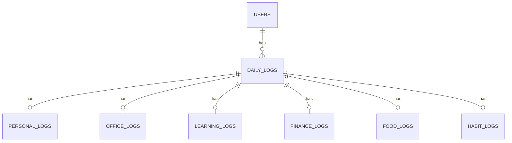
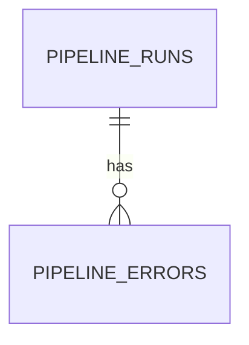

# Schema

Ten tables, numbered in dependency order (each file can be applied only after the ones before it). Two independent domains: personal daily-log data (`001`–`008`) and pipeline audit data (`009`–`010`).

## Personal Data Domain

| Table | File | Key columns | Notes |
|---|---|---|---|
| `users` | `001_users.sql` | `id` (PK), `email` (unique) | No columns beyond `name`, `email`, `created_at` — no auth/password fields |
| `daily_logs` | `002_daily_logs.sql` | `id` (PK), `user_id` (FK → `users`), `log_date` | `UNIQUE(user_id, log_date)` — one row per user per day; `ON DELETE CASCADE` from `users` |
| `personal_logs` | `003_personal_logs.sql` | `daily_log_id` (FK → `daily_logs`, unique) | `mood` constrained `1–5` |
| `office_logs` | `004_office_logs.sql` | `daily_log_id` (FK, unique) | `hours_worked` constrained `0–24` |
| `learning_logs` | `005_learning_logs.sql` | `daily_log_id` (FK, unique) | `study_hours` constrained `0–24` |
| `finance_logs` | `006_finance_logs.sql` | `daily_log_id` (FK, unique) | `daily_expense`, `income_received` both constrained `>= 0` |
| `food_logs` | `007_food_logs.sql` | `daily_log_id` (FK, unique) | `tea_coffee_count` constrained `0–20` |
| `habit_logs` | `008_habit_logs.sql` | `daily_log_id` (FK, unique) | `pushups` constrained `0–1000`; `reading_pages` constrained `>= 0` only (no upper bound) |

Every topic table (`003`–`008`) has `UNIQUE(daily_log_id)` and `ON DELETE CASCADE` back to `daily_logs`, which is what makes the `postgres_loader.py` upserts (`INSERT ... ON CONFLICT (daily_log_id) DO UPDATE`) valid — see [../../etl/load/README.md](../../etl/load/README.md). This is a vertical-partitioning design: one logical "day" is split into independently nullable topic tables instead of one wide `daily_logs` table with many nullable columns.

See [../../etl/validation/README.md](../../etl/validation/README.md) for how these `CHECK` constraints compare to the application-level validation rules — a couple of them don't match exactly.

## Pipeline Audit Domain

| Table | File | Key columns | Notes |
|---|---|---|---|
| `pipeline_runs` | `009_pipeline_runs.sql` | `id` (PK) | One row per `run_pipeline()` call: `started_at`, `completed_at`, `total_files`, `successful_files`, `failed_files`, `execution_time`, `status` |
| `pipeline_errors` | `010_pipeline_errors.sql` | `id` (PK), `pipeline_run_id` (FK → `pipeline_runs`) | One row per failed file: `file_name`, `stage`, `error_type`, `error_message`. `stage` is constrained to `EXTRACT`, `VALIDATION`, `TRANSFORMATION`, or `LOAD` (case-insensitive, via `UPPER(stage) IN (...)`) |

This domain has **no foreign key to `users` or `daily_logs`** — it tracks pipeline executions, not user data, and is written to independently of the data-loading transaction (see [../../etl/load/README.md](../../etl/load/README.md)).

## Indexes

`sql/indexes/001_indexes.sql` adds indexes on `daily_logs.log_date`, `daily_logs.is_completed`, and the `daily_log_id` foreign-key column on all six topic tables (supporting the joins used throughout `sql/views/` and `sql/queries/`). `pipeline_runs`/`pipeline_errors` have no indexes beyond their primary/foreign keys.
